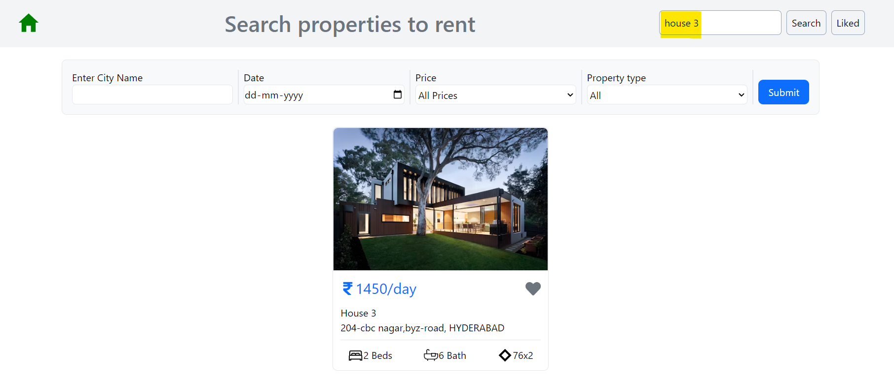
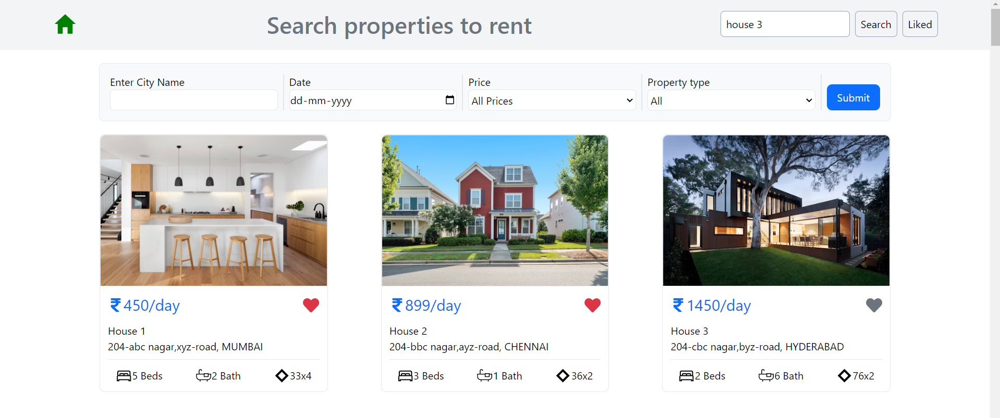
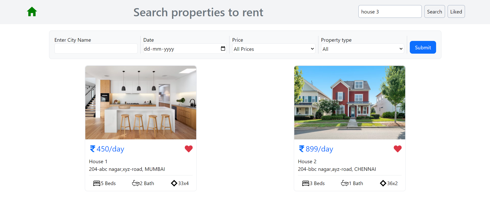
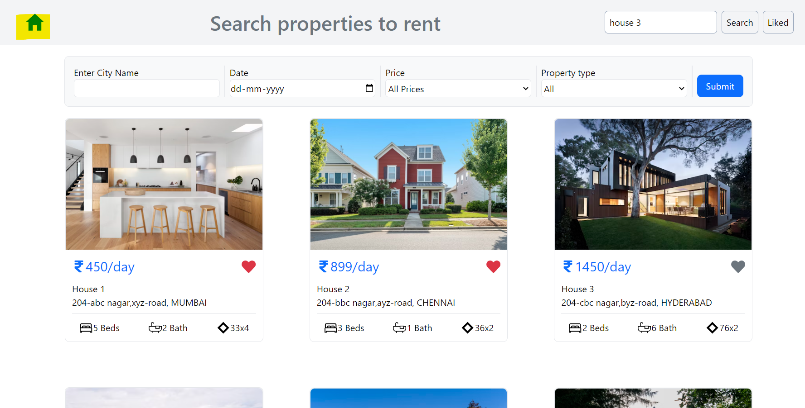

# Find the the perfect house for you!

This site is similar olx or other property website where you can find the perfect house for you 

This website is responsive as per screen size: 

 

Features of this web app:
The user can search for the correct house as per his or her requirement by using a single or a combination of filters for eg user can search by city name 

Or by price range 

Or a combination of above filters eg i have filtered using city and date

Also the user can directly search house using correct house name

Suppose you can confused between 2 or more houses to choose from them you can click on hear icon and add them to favorite list so that you compare them after clicking liked button on top right side of screen 

Additional features:
To reset the page ie clear out all the filters you can simply press home icon on top left portion of your screen 
